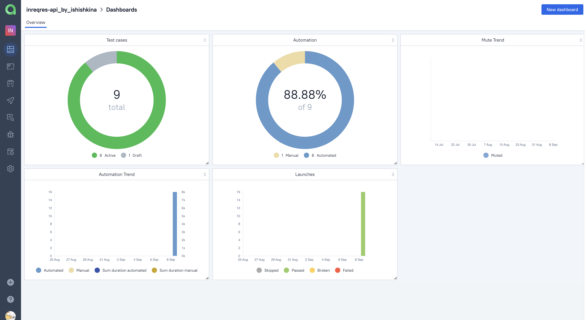

# Проект по автоматизации тестирования API [REQRES.in](https://reqres.in/#support-heading)

> REQRES.in — третий по популярности в мире открытый API позволяющий сторонним инженерам продемонстрировать свои навыки автоматизации тестирования API
## **Содержание:**
____

* <a href="#tools">Технологии и инструменты</a>

* <a href="#jenkins">Сборка в Jenkins</a>

* <a href="#console">Запуск из терминала</a>

* <a href="#allure">Allure отчет</a>

* <a href="#allure-testops">Интеграция с Allure TestOps</a>

* <a href="#jira">Интеграция с Jira</a>


____
<a id="tools"></a>
## <a name="Технологии и инструменты">**Технологии и инструменты:**</a>

<p align="center">  
<a href="https://www.jetbrains.com/idea/"></a>  
<a href="https://www.java.com/"></a>  
<a href="https://github.com/"></a>   
<a href="https://gradle.org/"></a>  
<a href="https://aerokube.com/selenoid/"></a>  
<a href="ht[images](images)tps://github.com/allure-framework/allure2"></a> 
<a href="https://qameta.io/"></a>   
<a href="https://www.jenkins.io/"></a>  
<a href="https://www.atlassian.com/ru/software/jira/"></a>  
</p>

1. [ ] Автотесты написаны на Java.
2. [ ] Gradle - используется как инструмент автоматизации сборки.
3. [ ] JUnit5 - используется для выполнения тестов.
4. [ ] Jenkins - используется CI/CD для запуска тестов удаленно.
5. [ ] Allure Report - используется для визуализации результатов тестирования.

Тесты проверяют:
1. [ ] Регистрация пользователя - позитивный, негативный тесты, проверка статуса
2. [ ] Авторизация пользователя - позитивный, негативный тесты,, проверка статуса
3. [ ] Обновление параметров пользователя (PUT), проверка статуса
4. [ ] Обновление параметров пользователя (PATCH), проверка статуса
____
<a id="jenkins"></a>

## </a><a name="Сборка"></a>Сборка в [Jenkins](https://jenkins.autotests.cloud/job/inreqres-api_by_ishishkina/)</a>
____
<p align="center">  
<a href="https://jenkins.autotests.cloud/job/inreqres-api_by_ishishkina///"></a>  
</p>

<a id="console"></a>
## Команды для запуска из терминала
___
***Локальный запуск:***
```bash  
gradle clean test
```

***Удалённый запуск через Jenkins:***
```bash  
clean test
```
___
<a id="allure"></a>
## </a> <a name="Allure"></a>Allure [отчет](https://jenkins.autotests.cloud/job/inreqres-api_by_ishishkina/allure/)</a>
___

### *Основная страница отчёта*

<p align="center">  
  
</p>  

### *Тест-кейсы*

<p align="center">  
  
</p>

### *Графики*

  <p align="center">  


  
</p>

___
<a id="allure-testops"></a>
## </a>Интеграция с <a target="_blank" href="https://allure.autotests.cloud/project/3655/dashboards">Allure TestOps</a>
____
### *Allure TestOps Dashboard*

<p align="center">  
  
</p>  

### *Демонстрация добавления ручных тест-кейсов*

<p align="center">  
  
</p>

### *Авто тест-кейсы*

<p align="center">  
  
</p>

___
<a id="jira"></a>
## </a> Интеграция с <a target="_blank" href="https://jira.autotests.cloud/browse/HOMEWORK-876">Jira</a>
____
<p align="center">  
  
</p>

____
